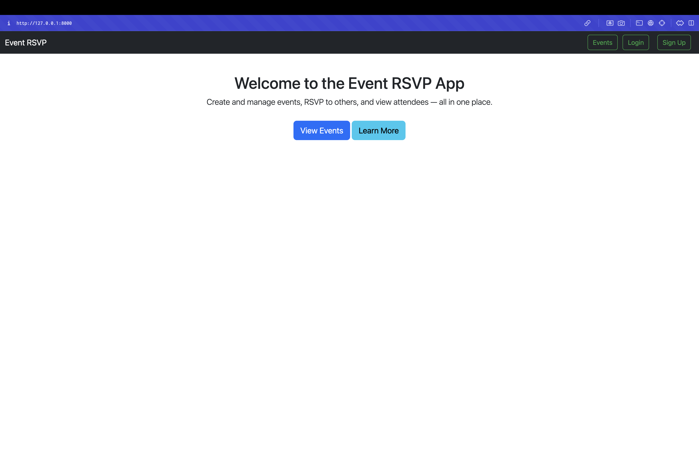
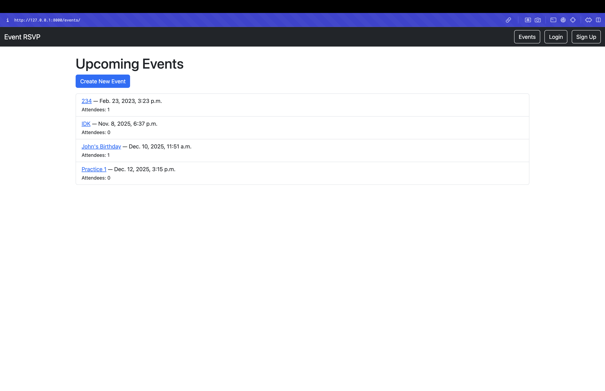
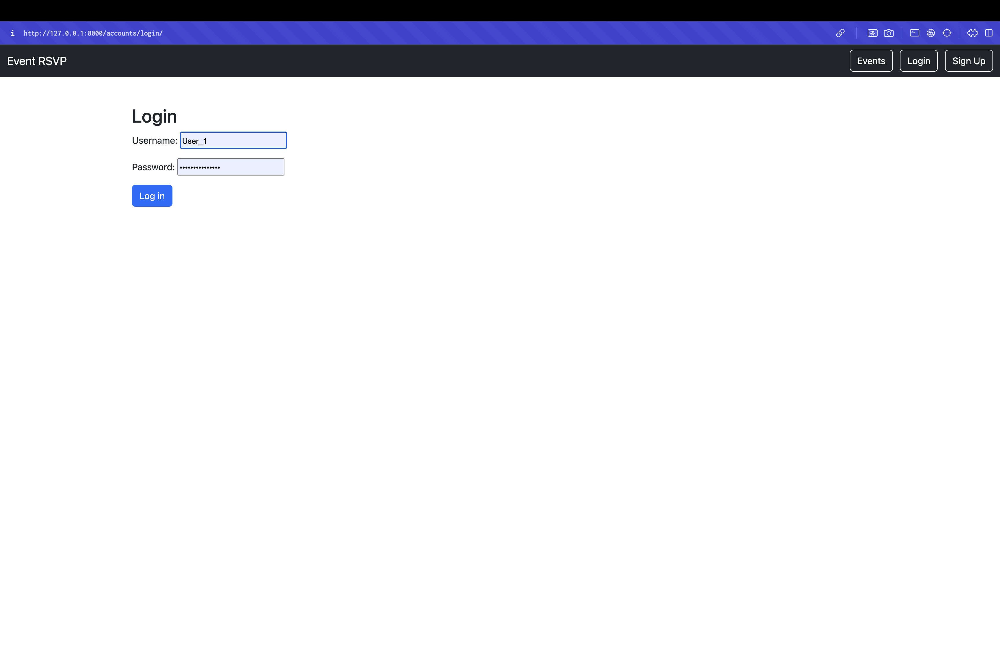

### INF601 - Advanced Programming in Python
### Alexander Escobedo 
### Mini Project 4
 
 
# Project Title
 
**Miniproject 4 Event RSVP**
 
## Description

Event RSVP is a Django web application that allows users to create, manage, and RSVP to community events.  
It features secure user registration and login, event creation with details like date and location, an RSVP system with status options, and an organizer dashboard to track attendees.  
This app uses **Bootstrap** for design and includes a **Bootstrap modal**, **Django Admin customization**, and an **RSVP attendee counter** for clear event management.


## Features 
* Secure user registration and authentication
* Create, edit, and view events with date, time, and location
* RSVP to events with "Going", "Maybe", or "Not Going" status
* View attendee counts and capacity limits
* Admin customization for easy management
* Bootstrap-styled UI with responsive design and modals


## Getting Started
 
### Dependencies
Before running the project, ensure you have:

* Python 3.10+ installed
* pip package manager
* SQLite (bundled with Python)
* Required Python packages (install via `requirements.txt`)

* *(If using Windows: tzdata package may also be required)*

### Installing
1. Clone the repository:

```
https://github.com/fhsuae/miniproject4AlexanderEscobedo.git
```
2. Create and activate a virtual environment:

Windows:

```
python -m venv venv
venv\Scripts\activate
```
macOS/Linux:
```
python3 -m venv venv
source venv/bin/activate
```
3. Install dependencies:

```
pip install -r requirements.txt
```
### Executing program
#### Initialize the database:

Ensure your working directory is the main Django project folder (`Event_RSVP_App/`)

1. Generate database migration files:
```
python manage.py makemigrations
```
> Django inspects your models and creates migration files — these are instructions for creating or updating database tables.


2. Apply migrations to the database:
```
python manage.py migrate
```
> Executes the migration files, creating or updating the actual database schema in SQLite.


3. Create an admin (superuser) account:
```
python manage.py createsuperuser
```
> Creates a new administrative user to access Django’s built-in admin dashboard. You’ll be prompted for a username, email, and password.


4. Start the Django development server:
```
python manage.py runserver
```
> Starts Django’s built-in web server so you can view and interact with your app locally.


Open your web browser and go to:
```
http://127.0.0.1:8000/
```

### Admin Access
To access the Django admin dashboard:
1. Go to:
```
http://127.0.0.1:8000/admin/
```
2. Log in using the credentials from: 
```
python manage.py createsuperuser
```
3. You can manage:
* Events 
* RSVPs 
* Users

### Using an IDE (Optional)
If you are using an IDE like PyCharm or VS Code:
* Open the project folder
* Go to Edit Configurations → Add New Configuration → Django Server.
* Set working directory to the project folder
* Enable Django Support (if using Pycharm) and set root point to Event_RSVP_App directory 
* Point to settings.py file in Event_RSVP_App/mysite/settings.py
* Set Manage script to manage.py file in Event_RSVP_App/manage.py 
* Click the Run ▶️ button to start the development server.

This lets you run and debug the Django app with one click.

If you are using another program that utilizes port 8000, you may change the port number by editing configurations and entering a port number that is not in use (8001 for example).

You may also use this command: 

```
python manage.py runserver 8001
```


### Project Pages

* **Home Page**: Event list and navigation
* **Event Details**: Information and RSVP options
* **Create Event**: Form to add new events
* **My Events**: Events created by the logged-in user
* **Attendees Dashboard**: Organizer view of RSVPs
* **Login / Signup**: Authentication pages

## Screenshots

### Home Page


### Events Page


### Login Page


## Authors
 
Alexander Escobedo 

 
## Version History

* 0.1
    * Initial Release
 
## Acknowledgments

* [Django Documentation](https://docs.djangoproject.com/en/5.2/)
* [Bootstrap Documentation](https://getbootstrap.com/docs/5.3/getting-started/download/)
* [The Official Django Tutorial ](https://docs.djangoproject.com/en/5.2/intro/tutorial01/)- Project structure adapted from this tutorial (Django version 5.2)
* [SQLite Documentation](https://sqlite.org/docs.html)